# B£G15M Program Flowchart

```mermaid
flowchart TD
    A[Program Start] --> B["INIZI Initialization"]
    B --> C{"Check if BG15M0F exists in QTEMP"}
    C -->|No| D["Create file using BWK20CL"]
    C -->|Yes| E["Try to OPEN BG15M0L"]
    D --> E
    E --> F["Set OG15 = IN35"]
    F --> G{"OG15 Status"}
    G -->|"OFF - Database Available"| H["Database Mode"]
    G -->|"ON - Database Not Available"| I["G75/G90 Mode"]
    
    H --> J["Main Function Processing"]
    I --> J
    
    J --> K{"Function Type"}
    K -->|VER| L["RVER - Verify Code"]
    K -->|SCA| M["RSCA - Scan Data"]  
    K -->|VIS| N["GES2 - Visualize Selection"]
    
    L --> O["RCHK - Check/Load Data"]
    M --> O
    N --> P["Set IN40=ON"] --> O
    
    O --> Q{"Type Changed or First Call?"}
    Q -->|Yes| R["Clear Arrays"]
    Q -->|No| S["Use Cached Data"]
    
    R --> T{"G15TP Blank?"}
    T -->|Yes| U["RLETC - Read Containers"]  
    T -->|No| V["RLETD - Read Definitions"]
    
    U --> W{"OG15 Status for Containers"}
    W -->|"OFF - DB Available"| X["Read from BG15M0L Database"]
    W -->|"ON - DB Not Available"| Y["Read from G75 System"]
    
    X --> X1["CHAIN BG15MR with BTTPK1=CON"]
    X1 --> X2{"Record Found?"}
    X2 -->|Yes| X3["SETLL + READE Loop"]
    X2 -->|No| Y
    X3 --> X4["Load CON array from BTCD01+BTCD02"]
    X4 --> Z["Process Each Container"]
    
    Y --> Y1["G75FU=RIT, G75ME=INI"]
    Y1 --> Y2["G75NF=SCP_TAB"]
    Y2 --> Y3["DOW IN35=OFF Loop"]
    Y3 --> Y4["Load CON array from G75MB+G75DE"]
    Y4 --> Y5{"OG15=OFF?"}
    Y5 -->|Yes| Y6["WRITE BG15MR - Cache to Database"]
    Y5 -->|No| Y7["No Caching"]
    Y6 --> Z
    Y7 --> Z
    
    Z --> Z1["For Each Container: Call RLETD"]
    
    V --> AA{"OG15 Status for Definitions"}
    AA -->|"OFF - DB Available"| BB["Read from BG15M0L Database"]
    AA -->|"ON - DB Not Available"| CC["Read from G90 System"]
    
    BB --> BB1["Parse Container.Chapter from G15TP"]
    BB1 --> BB2["CHAIN BG15MR with Key"]
    BB2 --> BB3{"Record Found?"}
    BB3 -->|Yes| BB4["SETLL + READE Loop"]
    BB3 -->|No| CC
    BB4 --> BB5["Load SCH arrays from BTLIBE, BTCD fields"]
    BB5 --> DD["Return to Main Logic"]
    
    CC --> CC1["Parse Container.Chapter from G15TP"]
    CC1 --> CC2["G90FU=LET, G90ME=SETLL"]
    CC2 --> CC3["Build G90SO with Lib LIBL Fil SCP_TAB Mem container"]
    CC3 --> CC4["DO HIVAL Loop"]
    CC4 --> CC5["Call RLETDR - Read Definition Record"]
    CC5 --> CC6{"IN35 or XDV not empty?"}
    CC6 -->|Yes| CC7["LEAVE Loop"]
    CC6 -->|No| CC8["Load SCH arrays from G90SO"]
    CC8 --> CC9{"OG15=OFF?"}
    CC9 -->|Yes| CC10["WRITE BG15MR - Cache to Database"]
    CC9 -->|No| CC11["No Caching"]
    CC10 --> CC4
    CC11 --> CC4
    CC7 --> DD
    
    S --> DD
    
    DD --> EE{"Original Function"}
    EE -->|VER| FF["Verification Logic"]
    EE -->|SCA| GG["Scanning Logic"]
    EE -->|VIS| HH["Visualization Logic"]
    
    FF --> FF1{"Code starts with special chars?"}
    FF1 -->|Yes| FF2["Set G1536=ON - Call GES2"]
    FF1 -->|No| FF3["Search in SCH arrays"]
    FF3 --> FF4{"Code Found?"}
    FF4 -->|Yes| FF5["Return Description"]
    FF4 -->|No| FF6["Set G1535=ON"]
    FF2 --> II
    FF5 --> II
    FF6 --> II
    
    GG --> GG1{"Method = POS?"}
    GG1 -->|Yes| GG2["Position Logic"]
    GG1 -->|No| GG3["Sequential Read"]
    GG2 --> GG4["Find Position in SCH array"]
    GG3 --> GG4
    GG4 --> GG5{"More Data?"}
    GG5 -->|Yes| GG6["Return Next Code/Description"]
    GG5 -->|No| GG7["Set G1535=ON"]
    GG6 --> II
    GG7 --> II
    
    HH --> HH1["Build 08A array from SCH"]
    HH1 --> HH2["Call G08 Selection"]
    HH2 --> HH3{"Selection Made?"}
    HH3 -->|Yes| HH4["Return Selected Code"]
    HH3 -->|No| HH5["Set G1535=ON"]
    HH4 --> II
    HH5 --> II
    
    II["RETURN"] --> JJ["End"]

    classDef dbMode fill:#e1f5fe,stroke:#01579b,stroke-width:2px
    classDef g75Mode fill:#fff3e0,stroke:#e65100,stroke-width:2px
    classDef decision fill:#f3e5f5,stroke:#4a148c,stroke-width:2px
    classDef process fill:#e8f5e8,stroke:#1b5e20,stroke-width:2px
    
    class H,X,X1,X2,X3,X4,BB,BB1,BB2,BB3,BB4,BB5,Y6,CC10 dbMode
    class I,Y,Y1,Y2,Y3,Y4,Y7,CC,CC1,CC2,CC3,CC4,CC5,CC8,CC11 g75Mode
    class C,G,K,Q,T,W,AA,X2,BB3,CC6,CC9,EE,GG1,GG5,HH3,FF1,FF4,Y5 decision
    class A,B,D,E,F,J,L,M,N,O,P,R,S,U,V,Z,Z1,DD,FF,GG,HH,II,JJ process
```

## Flowchart Legend

### Color Coding
- 🔵 **Blue (Database Mode)**: Operations that occur when OG15 = OFF (database available)
- 🟠 **Orange (G75/G90 Mode)**: Operations that occur when OG15 = ON (database not available)  
- 🟣 **Purple (Decisions)**: Decision points that affect program flow
- 🟢 **Green (Process)**: General processing steps

### Key Decision Points
1. **OG15 Status Check**: Determines whether to use database or G75/G90 systems
2. **Caching Logic**: When OG15 = OFF, data is cached to database for future use
3. **Function Type**: VER (verify), SCA (scan), or VIS (visualize) determines processing path
4. **Record Availability**: Falls back to G75/G90 if database records not found

### Performance Impact
- **Left Path (Blue)**: Faster, cached database operations
- **Right Path (Orange)**: Slower, real-time system calls with no caching
