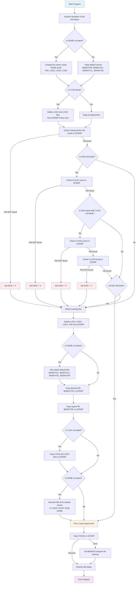

```mermaid
flowchart TD
    A[Start Program] --> B[Declare Variables & Get Job Status]
    B --> C{Is NOME not blank?}
    
    C -->|Yes| D[Change file names using NOME prefix<br/>FISI, LOG1, LOG2, LOG3]
    C -->|No| E[Keep default names<br/>B£WKXT0F, B£WKXT0L, B£WKXT1L, B£WKXT2L]
    
    D --> F{Is TLOG blank?}
    E --> F
    
    F -->|Yes| G[Delete LOG2 and LOG3 files<br/>from QTEMP if they exist]
    F -->|No| H[Keep all logical files]
    
    G --> I[Check if physical file FISI exists in QTEMP]
    H --> I
    
    I -->|File NOT found| J[Set ESIS = '1']
    I -->|File found| K{Is ESIS still blank?}
    
    J --> AA[Delete and recreate files]
    
    K -->|Yes| L[Check if LOG1 exists in QTEMP]
    K -->|No| AA
    
    L -->|File NOT found| M[Set ESIS = '1']
    L -->|File found| N{Is ESIS blank AND TLOG not blank?}
    
    M --> AA
    
    N -->|Yes| O[Check if LOG2 exists in QTEMP]
    N -->|No| P{Is ESIS still blank?}
    
    O -->|File NOT found| Q[Set ESIS = '1']
    O -->|File found| R[Check if LOG3 exists in QTEMP]
    
    Q --> AA
    
    R -->|File NOT found| S[Set ESIS = '1']
    R -->|File found| P
    
    S --> AA
    
    P -->|Yes| T[GOTO PULI - Skip file creation]
    P -->|No| AA
    
    AA[Delete existing files] --> BB[Delete LOG3, LOG2, LOG1, FISI from QTEMP]
    BB --> CC{Is NOME not blank?}
    
    CC -->|Yes| DD[Also delete default files<br/>B£WKXT2L, B£WKXT1L, B£WKXT0L, B£WKXT0F]
    CC -->|No| EE[Copy physical file B£WKXT0F to QTEMP]
    
    DD --> EE
    
    EE --> FF[Copy logical file B£WKXT0L to QTEMP]
    FF --> GG{Is TLOG not blank?}
    
    GG -->|Yes| HH[Copy LOG2 and LOG3 files to QTEMP]
    GG -->|No| II{Is NOME not blank?}
    
    HH --> II
    
    II -->|Yes| JJ[Rename files from default names<br/>to custom names using NOME]
    II -->|No| T
    
    JJ --> T
    
    T[PULI: Clear physical file] --> KK[Clear FISI file in QTEMP]
    KK -->|Success| LL[Restore job status]
    KK -->|Error| MM[Call B£WK20 program for cleanup]
    
    MM --> LL
    LL --> NN[End Program]
    
    style A fill:#e1f5fe
    style NN fill:#f3e5f5
    style T fill:#fff3e0
    style J fill:#ffebee
    style M fill:#ffebee
    style Q fill:#ffebee
    style S fill:#ffebee
```