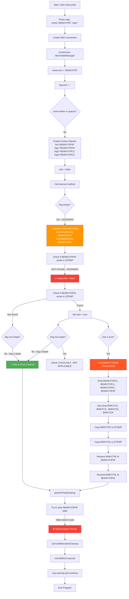

# B£WK20CL Scenario Analysis: nome ≠ blank, tlog = blank, fisi NOT found

This document analyzes the behavior of the `B£WK20CL` program when invoked with specific parameters, particularly focusing on scenarios where the `nome` is not blank, `tlog` is blank, and `fisi` does not exist in the QTEMP library.

The purpose of this program is to create a temporary database file named `nome` if it does not already exist, and clean it up before the program ends. 

## Scenario Parameters
- **nome**: Not blank (e.g., "B£WKXT0F")
- **tlog**: Blank/empty
- **fisi**: Does NOT exist in QTEMP

## Step-by-Step Execution Flow



## Most Likely Execution Path

Based on the scenario parameters, here's what **most likely happens**:

### 1. **Constructor Phase** ✅
```java
// Custom names are set
fisi = "B£WKXT0F0F"
log1 = "B£WKXT0F0L" 
log2 = "B£WKXT0F1L"
log3 = "B£WKXT0F2L"
esis = false
```

### 2. **Execute Method - Early Cleanup** 🔥
```java
// Since tlog is empty, delete LOG2 and LOG3
dropTableIfExists("QTEMP", "B£WKXT0F1L");  // Delete if exists
dropTableIfExists("QTEMP", "B£WKXT0F2L");  // Delete if exists
```

### 3. **Table Existence Checks** 🔍
```java
// Check FISI (B£WKXT0F0F) - NOT FOUND (scenario condition)
if (tableExists("QTEMP", "B£WKXT0F0F")) {  // false
    esis = true;  // NOT executed
}

// Check LOG1 (B£WKXT0F0L) 
if (!esis) {  // true, so check LOG1
    if (tableExists("QTEMP", "B£WKXT0F0L")) {
        esis = true;  // May or may not happen
    }
}
```

### 4. **Two Possible Branches** 🔀

#### **Branch A: LOG1 NOT Found** (Most Likely)
- `esis` remains `false`
- Goes directly to `performFinalCleanup()`
- Tries to `clearTable("QTEMP", "B£WKXT0F0F")`
- **FAILS** because B£WKXT0F0F doesn't exist
- Calls `callAlternativeCleanup()` → BWK20.execute()

#### **Branch B: LOG1 Found** (Less Likely)
- `esis` becomes `true`
- Triggers **full cleanup and recreation phase**
- Deletes all existing tables (both B£WKXT0F and BWKXT series)
- Recreates tables with custom names

## Expected Outcome

**Most Probable Result**: The program will attempt to clear a non-existent table (B£WKXT0F0F), fail, and call the alternative cleanup routine (BWK20).

## Key Code Sections Executed

```java
// 1. Early deletion (always executed)
if (tlog.isEmpty()) {
    dropTableIfExists(QTEMP_SCHEMA, log2); // B£WKXT0F1L
    dropTableIfExists(QTEMP_SCHEMA, log3); // B£WKXT0F2L
}

// 2. Most likely path - direct cleanup
if (!esis) {
    performFinalCleanup(); // Skip table recreation
}

// 3. Cleanup failure handling
try {
    clearTable(QTEMP_SCHEMA, fisi); // B£WKXT0F0F
} catch (SQLException e) {
    callAlternativeCleanup(); // BWK20 fallback
}
```

## Files Affected

**Deleted**: B£WKXT0F1L, B£WKXT0F2L (if they existed)
**Attempted Clear**: B£WKXT0F0F (will fail)
**Fallback**: BWK20 cleanup routine handles the error
