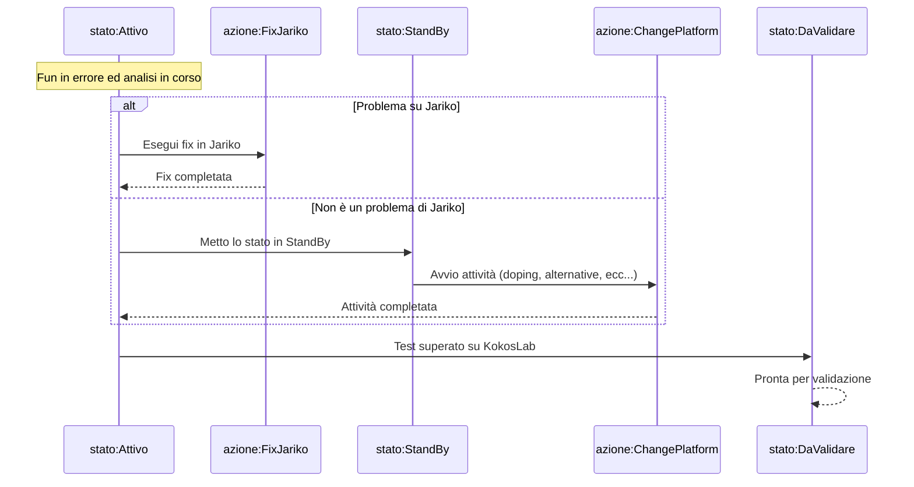

# Sviluppare

- [Feat/jdbc cache driver proxy #96](https://github.com/smeup/kokos-me-rpgle-smeuperp/pull/96)

# Drogare una /COPY

- [.github/copilot-instructions.md](https://github.com/smeup/kokos-me-rpgle-smeuperp/blob/develop/.github/copilot-instructions.md) - prompt di default per Copilot, nella fattispecie: regole per creare una /COPY drogata, ma potrebbe contenere anche altre istruzioni.
- [feat: Implement B£RND0 Random Number Generator with MT1 and MT2 methods](https://github.com/smeup/kokos-me-rpgle-smeuperp/commit/435df3b041d1bfd1a98e1032bea322f29dd93a0c)

# Capire

## Gestione file temporanei

### B£G15M

[B£G15M.rpgle](https://github.com/smeup/kokos-dsl-smeuperp/blob/develop/JASRC/B£G15M.rpgle)

Non riuscivo a capire il senso dell'accensione dell'indicatore di errore 35 sia nella call che nell'open.
```rpgle
     C                   CALL      'B£WK20CL'                           35
     C                   PARM      'B£G15M'      P$NOME            6
     C                   PARM      ''            P$LOGI            1
     C                   ENDIF
     C                   OPEN      B£G15M0L                             35
     C                   EVAL      $$OG15=*IN35
```

* [Cosa succede \$\$OG15 è \*OFF piuttosto che \*ON](docs/B£G15M_Detailed_Scenarios.md)
* [Program flowchart](docs/B£G15M_Complete_Flowchart.md)

### Doping di B£WK20CL

Avevo fatto convertire al LLM il codice di [`B£WK20CL.CLLE`](https://labdocs.smeup.com/it/H3LS04-NW25000469/LS25002920/B£WK20CL) ma c'era qualcosa che non mi tornava.

* [Cosa succede se devo creare un un file temporaneo che non esiste?](docs/B£WK20CL_Java.md)
* [Quale è il comportamento del PGM che stiamo drogando?](docs/B£WK20CL_CLLE.md)


# Documentare

* [README kokos-me-rpgle-smeuperp](https://github.com/smeup/kokos-me-rpgle-smeuperp)
* [Telemetria in SDK](https://github.com/smeup/kokos-sdk-java-rpgle/blob/develop/docs/TELEMETRY.md)


# Rendicontare
* [Prompt](https://share.evernote.com/note/8cfd74dc-503b-e6f4-8cfb-efae02bb5dc2)
* [Annual Progress Report – Jariko Project](docs/jariko-report-20250387.pdf)
* [Annual Progress Report – MEX smeupERP Project](docs/kokos-me-rpgle-smeuperp-20250703.pdf)

# Fare diagrammi

## Fun driven development


## Copilot agent

[Copilot agent](docs/copilot_agent.md)

## DSLEditor - Interazione tra i key component

* [Component Interaction Diagram](https://github.com/smeup/scpscheditor/blob/develop/docs/technical-documentation.md#component-interaction-diagram)

# Quale LLM utilizzare

Se parliamo di RPGLE Claude è insuperabile.
Se parliamo di Java, Python, sembrerebbero equivalenti, ma non ho ancora fatto prove comparative.

# Copilot individual Pro

* Modalità ask, edit, agent
* Possibilità di selezionare LLM
* Inline Chat e generazione di test infinite
* Modalita agent:

  * Richieste standard infinite solo per LLM di OpenAI
  * Richieste premium (altri LLM) sono limitate a 300 richieste al mese, ogni richiesta aggiuntiva costa 0.04 USD

