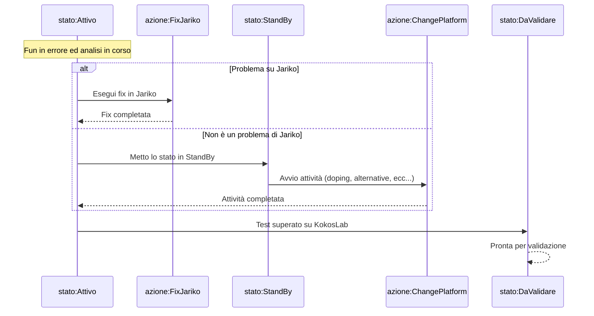

# Sviluppare
- [Feat/jdbc cache driver proxy #96](https://github.com/smeup/kokos-me-rpgle-smeuperp/pull/96)

# Capire

## Gestione file temporanei

### B£G15M

[B£G15M.rpgle](https://github.com/smeup/kokos-dsl-smeuperp/blob/develop/JASRC/B%C2%A3G15M.rpgle)

Non riuscivo a capire il senso dell'accensione dell'indicatore di errore 35 sia nella call che nell'open.
```rpgle
     C                   CALL      'B£WK20CL'                           35
     C                   PARM      'B£G15M'      P$NOME            6
     C                   PARM      ''            P$LOGI            1
     C                   ENDIF
     C                   OPEN      B£G15M0L                             35
     C                   EVAL      $$OG15=*IN35
```
- [Cosa succede $$OG15 è *OFF piuttosto che *ON](docs/B%C2%A3G15M_Detailed_Scenarios.md)
- [Program flowchart](docs/B%C2%A3G15M_Complete_Flowchart.md)

### Doping di B£WK20CL

Avevo fatto convertire al LLM il codice di `B£WK20CL.CLLE` ma c'era qualcosa che non mi tornava.

- [Cosa succede se devo creare un un file temporaneo che non esiste?](docs/B£WK20CL_Java.md)
- [Quale è il comportamento del PGM che stiamo drogando?](docs/B%C2%A3WK20CL_CLLE.md)


C'era un return di troppo nel PGM drogato!!!

# Documentare

- [README kokos-me-rpgle-smeuperp](https://github.com/smeup/kokos-me-rpgle-smeuperp)
- [Telemetria in SDK](https://github.com/smeup/kokos-sdk-java-rpgle/blob/develop/docs/TELEMETRY.md)

# Fare diagrammi

## Fun driven development



## DSLEditor - Interazione tra i key component

- [Component Interaction Diagram](https://github.com/smeup/scpscheditor/blob/develop/docs/technical-documentation.md#component-interaction-diagram)


# Brainstorming

[Jariko Performance Optimization Report](https://github.com/smeup/jariko/blob/perf/performance_analysis/docs/performance_optimization_report.md)


